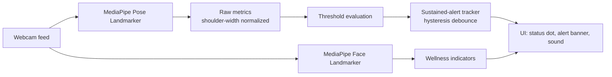

<div align="center">

# 🧍 Upright AI

**Your posture coach that lives in a browser tab.**

Real-time posture and wellness monitoring — powered entirely by on-device computer vision. No video ever leaves your machine.

[**Live Demo**](https://upright-ai.vercel.app/) · [Report a Bug](https://github.com/maryamjaved693/upright-AI/issues) · [Request a Feature](https://github.com/maryamjaved693/upright-AI/issues)

</div>

---

## Why this exists

You sit down to "quickly check one thing" and forty minutes later your neck's at a 45° angle, your shoulders are somewhere near your ears, and you've been breathing through a slouch the whole time. Most posture apps need a wearable, a subscription, or your video uploaded to a server.

Upright AI just needs your webcam and a browser tab. It watches your posture in real time using pose-tracking, gives you a gentle nudge when it slips for too long — not for every fidget — and reminds you to actually get up once in a while.

## What it catches

| Signal | What triggers it |
|---|---|
| 🙇 **Forward neck lean** | Head drifting down and forward, toward the shoulders |
| 🦴 **Slouching** | Torso compressing/rounding forward (needs hips in frame) |
| 📏 **Sitting too close** | Shoulder width taking up too much of the frame |
| ↔️ **Leaning left / right** | Head tilting off-center |
| 😴 **Tired eyes / yawning** | Facial cues suggesting you need a break |
| 🙂 **Mood signals** | Lightweight, approximate — not a clinical read |

Alerts only fire once an issue has been **sustained** for a few seconds, and clear once you've held good posture again — so a one-second slouch to grab your coffee won't set off an alarm.

## How it works



Everything above runs **inside your browser** via WebAssembly + GPU-accelerated MediaPipe models — nothing is ever uploaded.

<details>
<summary><strong>Why shoulder-width normalization instead of a calibration step?</strong></summary>

<br>

Shoulder width in the frame scales with both camera distance *and* body size, so dividing every other metric by it cancels out most of that variance. That's what lets fixed thresholds work reasonably well across different setups without asking you to sit still for a 10-second calibration wizard first. You can still fine-tune sensitivity per-signal from the sidebar if the defaults don't fit your desk.

</details>

<details>
<summary><strong>Why the asymmetric alert timing?</strong></summary>

<br>

Triggering an alert requires posture to stay bad for a few seconds (avoids nagging on brief movements); clearing it only requires a shorter stretch of good posture (so you're not stuck "in alert" after you've already fixed it). It's a small hysteresis window tuned to feel responsive without being twitchy.

</details>

## Getting started

```bash
git clone https://github.com/maryamjaved693/upright-AI.git
cd upright-AI
npm install
npm run dev
```

Open the local URL it prints, allow camera access, and sit like you mean it.

<table>
<tr><td><code>npm run dev</code></td><td>Start the dev server with hot reload</td></tr>
<tr><td><code>npm run build</code></td><td>Type-check and build for production</td></tr>
<tr><td><code>npm run preview</code></td><td>Preview the production build locally</td></tr>
<tr><td><code>npm run test</code></td><td>Run the scoring/wellness unit test suite</td></tr>
<tr><td><code>npm run lint</code></td><td>Lint with Oxlint</td></tr>
</table>

## Tech stack

- **React 19 + TypeScript** — UI and state
- **Vite** — dev server & build
- **[MediaPipe Tasks Vision](https://developers.google.com/mediapipe/solutions/vision/pose_landmarker)** — on-device pose + face landmark detection (WASM/GPU)
- **Vitest** — unit tests for the scoring and wellness logic

## Project layout

```
src/
├── pose/         webcam capture + MediaPipe pose landmarker hook
├── face/         MediaPipe face landmarker hook (wellness signals)
├── scoring/       posture metrics → thresholds → sustained-alert tracker
├── wellness/      facial-cue metrics → thresholds → sustained tracker
├── hooks/         React hooks tying it all together (monitor, break timer, audio)
├── components/    UI: webcam view, status indicator, alert banner, settings
└── audio/         beep-based audio alert
```

## Privacy

Your webcam frames are processed locally in your browser using WebAssembly-compiled models — nothing is uploaded, streamed, or stored anywhere. Close the tab and it's gone.

## Contributing

Issues and PRs welcome — especially if you've got a desk setup where the default thresholds misfire. Open an issue with what triggered incorrectly and the values from the **Debug: live metrics** panel in the sidebar; that's usually enough to tune the defaults.
</content>
